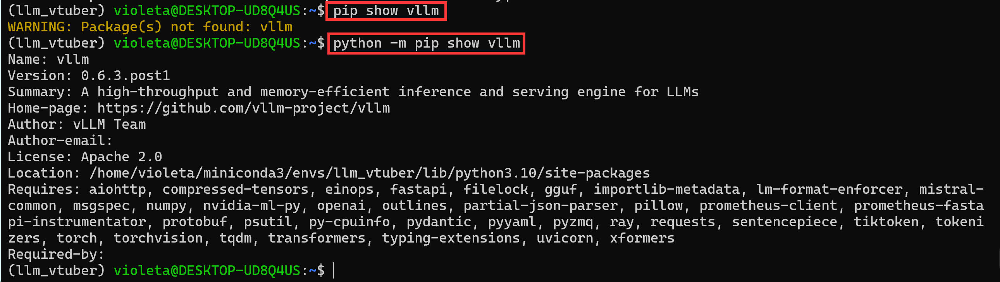
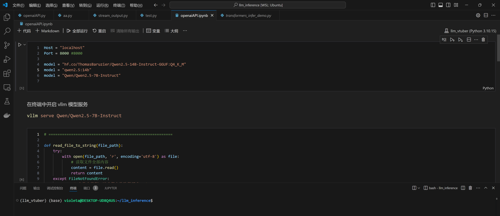
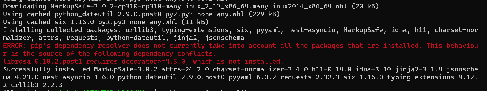
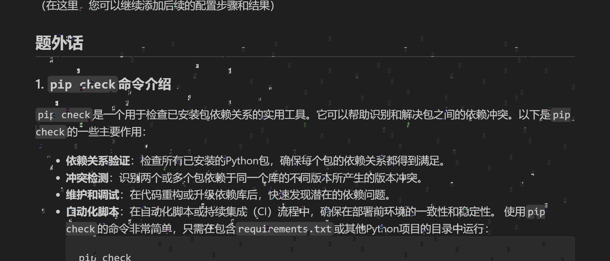

# 深度学习环境配置记录

## 系统信息

### WSL2 环境
- **内核版本**：Linux version 5.15.167.4-microsoft-standard-WSL2
- **发行版版本**：Ubuntu 24.04.1 LTS
- **宿主系统**：Windows 11 专业版 23H2
- **宿主系统版本号**：22631.4460

### 物理主机配置
- **处理器**：12th Gen Intel(R) Core(TM) i9-12900K 3.20 GHz
- **内存**：32.0 GB
- **显卡**：
  - **型号**：NVIDIA GeForce RTX 3090 Ti
  - **显存大小**：24 GB GDDR6X
  - **CUDA核心数量**：10752
  - **显卡驱动版本**：560.94
  - **CUDA版本**：12.6.65

## 环境配置记录

### 初始配置
- 安装WSL2
- 安装Ubuntu 24.04.1 LTS
- 安装Windows 11 专业版 23H2

### Conda配置
1. 创建Miniconda3目录：
   ```bash
   mkdir -p ~/miniconda3
2. 下载Miniconda3安装脚本：
    ```bash
    wget https://repo.anaconda.com/miniconda/Miniconda3-latest-Linux-x86_64.sh -O ~/miniconda3/miniconda.sh
    ```
3. 安装Miniconda3：
    ```bash
    bash ~/miniconda3/miniconda.sh -b -u -p ~/miniconda3
    ```
4. 删除安装脚本：
    ```bash
    rm ~/miniconda3/miniconda.sh
    ```
5. 激活Miniconda3环境：
    ```bash
    source ~/miniconda3/bin/activate
    ```
6. 初始化conda环境：
    ```bash
    conda init --all
    ```
7. 创建名为llm_vtuber的conda环境，并指定Python版本为3.10.15：
   ```bash
   conda create --name llm_vtuber python="3.10.15"
   ```
8. 激活名为llm_vtuber的conda环境：
   ```bash
   conda activate llm_vtuber
   ```
9. ~~安装PyTorch及其相关库，并指定CUDA版本：~~（别看这条，直接看下一条）
   ```bash
   conda install pytorch torchvision torchaudio pytorch-cuda=12.4 -c pytorch -c nvidia
   ```
10. 2024/11/17 更新：conda 和 pip 混用真的很捉急，放弃使用conda来下载包了，只使用它的创建和切换虚拟环境功能
    ```bash
    python -m pip install torch torchvision torchaudio
    ```

### GPU加速测试
- 启动Python并测试PyTorch GPU加速是否可用：
  ```python
  import torch
  print(torch.cuda.is_available())
  ```
  返回 True 说明可用。至此环境配置基本完成。

### 安装 Open-LLM-Vtuber 项目
1. 安装 ffmpeg：
    ```bash
    sudo apt update
    sudo apt install ffmpeg
    ```
2. 克隆Open-LLM-VTuber项目仓库：
    ```bash
    git clone https://github.com/t41372/Open-LLM-VTuber
    ```
3. 进入项目目录:
   ```bash
   cd Open-LLM-VTuber
   ```
4. 安装项目依赖：
    ```bash
    python -m pip install -r requirements.txt # 在项目目录中运行此命令
    ```
4. 项目中实际使用到但没有写进 requireme.txt 里的：
    ```bash
    python -m pip install -U modelscope funasr
    ```
5. 安装vllm作为LLM后端：
    ```bash
    python -m pip install vllm
    ```
6. 下载 LLM，这里使用 Qwen2.5：
    ```bash
    # Load and run the model:
    vllm serve "Qwen/Qwen2.5-0.5B-Instruct"
    ```
## WSL2 中安装 CUDA Toolkit 12.6
参考链接：https://developer.nvidia.com/cuda-downloads?target_os=Linux&target_arch=x86_64&Distribution=WSL-Ubuntu&target_version=2.0&target_type=deb_network
1. 下载CUDA仓库密钥环：
    ```bash
    wget https://developer.download.nvidia.com/compute/cuda/repos/wsl-ubuntu/x86_64/cuda-keyring_1.1-1_all.deb
    ```
2. 安装CUDA仓库密钥环：
   ```bash
   sudo dpkg -i cuda-keyring_1.1-1_all.deb
   ```
3. 更新包列表：
   ```bash
   sudo apt-get update
   ```
4. 安装CUDA Toolkit 12.6：
   ```bash
   sudo apt-get -y install cuda-toolkit-12-6
   ```
5. 配置CUDA环境变量：
   ```bash
   nano ~/.bashrc
   ```
6. 在~/.bashrc文件中添加以下内容：
   ```bash
    # Config CUDA
    # 注意：/usr/local/cuda 是 /usr/local/cuda-12.6 的软链接
    export CUDA_HOME=/usr/local/cuda
    export PATH=$PATH:$CUDA_HOME/bin
    export LD_LIBRARY_PATH=$LD_LIBRARY_PATH:$CUDA_HOME/lib64
    export LD_LIBRARY_PATH=$LD_LIBRARY_PATH:$CUDA_HOME/extras/CUPTI/lib64
    ```
7. 应用更改：
    ```bash
    source ~/.bashrc
    ```
8. 验证安装是否成功：
    ```bash
    nvcc
    # 应该有以下输出：
    # nvcc fatal   : No input files specified; use option --help for more information
    ```
## ~~安装 Jupyter 过程~~ 此栏目只具有警示意义了。安装的话直接看下一个栏目 “安装 Jupyter 和 vllm 过程（更新）” 吧
参考链接：[https://jupyter.org/install](https://jupyter.org/install)
~~由于我是在conda环境下安装~~，于是当时运行了如下命令（在 ``llm_vtuber`` 环境中）。

2024/11/17更新：别使用conda-forge了。混用conda-forge和pip真的很难绷，会造成奇怪的依赖问题，今天因此被迫重装整个环境。
### 1. 安装 jupyterlab
   ```bash
   conda -c conda-forge install jupyterlab
   ```
### 2. 安装好后我就发现 vllm 运行不了了
```bash
vllm serve "Qwen/Qwen2.5-0.5B-Instruct"
```
出现报错：
```bash
Process SpawnProcess-1:
 Traceback (most recent call last):
File "/home/violeta/miniconda3/envs/llm_vtuber/lib/python3.10/multiprocessing/process.py", line 314, in _bootstrap
 self.run()
File "/home/violeta/miniconda3/envs/llm_vtuber/lib/python3.10/multiprocessing/process.py", line 108, in run
 self._target(*self._args, **self._kwargs)
File "/home/violeta/miniconda3/envs/llm_vtuber/lib/python3.10/site-packages/vllm/engine/multiprocessing/engine.py", line 390, in run_mp_engine
 engine = MQLLMEngine.from_engine_args(engine_args=engine_args,
File "/home/violeta/miniconda3/envs/llm_vtuber/lib/python3.10/site-packages/vllm/engine/multiprocessing/engine.py", line 139, in from_engine_args
 return cls(
File "/home/violeta/miniconda3/envs/llm_vtuber/lib/python3.10/site-packages/vllm/engine/multiprocessing/engine.py", line 78, in __init__
 self.engine = LLMEngine(*args, **kwargs)
File "/home/violeta/miniconda3/envs/llm_vtuber/lib/python3.10/site-packages/vllm/engine/llm_engine.py", line 439, in __init__
 from vllm.engine.metrics import (LoggingStatLogger,
File "/home/violeta/miniconda3/envs/llm_vtuber/lib/python3.10/site-packages/vllm/engine/metrics.py", line 23, in <module>
 prometheus_client.disable_created_metrics()
AttributeError: module 'prometheus_client' has no attribute 'disable_created_metrics'
```
### 3. 问题成因
- `jupyterlab` 使用的 `prometheus_client` 版本是 `0.14.0`
- 而 `vllm` 所要求的版本 >= `0.18.0`，详见其 [`requirements-common.txt`](https://github.com/vllm-project/vllm/blob/main/requirements-common.txt)
- 因为 `jupyterlab` 是后于 `vllm` 安装的。所以运行 `vllm` 调用 `prometheus_client` 便出现了依赖问题

### 4. 详细排查过程
排查时发现，安装 `vllm` 时作为依赖安装的 `prometheus_client=0.21.0` 并没有被卸载。
<br>这是因为安装 `vllm` 时使用的是 `pip` 方式。经后来用 `which pip` 检查发现：即使是在 `llm_vtuber` 的 `conda` 环境中，`pip` 命令也是全局的，如下：
```bash
(llm_vtuber) violeta@DESKTOP-UD8Q4US:~$ which pip
/home/violeta/.local/bin/pip
```

但是还好，起码 `python` 并不是全局的：
```bash
(llm_vtuber) violeta@DESKTOP-UD8Q4US:~$ which python
/home/violeta/miniconda3/envs/llm_vtuber/bin/python
```

所以，在下方的代码块中可以看到 `prometheus_client=0.21.0` 并没有安装在环境 `llm_vtuber` 中。
反而是随着来源于 `conda-forge` 的 `jupyterlab` 所一起安装的 `prometheus_client=0.14.0` 被安装在了 `llm_vtuber` 的 `site-packages` 目录中。
<br><br>
至于为什么 `prometheus_client=0.21.0` 安装在了环境 `python_c` 的 `site-packages` 目录中，已不可考。
可能是由于创建 `python_c` 环境时，以某种方式指定了其为全局的 `pip` 的 package 地址吧。

```bash
# 直接使用 pip 时，pip 是全局的
(llm_vtuber) violeta@DESKTOP-UD8Q4US:~$ pip show prometheus_client
Name: prometheus_client
Version: 0.21.0
Summary: Python client for the Prometheus monitoring system.
Home-page: https://github.com/prometheus/client_python
Author: Brian Brazil
Author-email: brian.brazil@robustperception.io
License: Apache Software License 2.0
Location: /home/violeta/miniconda3/envs/python_c/lib/python3.11/site-packages
Requires:
Required-by:

# 'python -m pip' 使用的是环境内的 pip
(llm_vtuber) violeta@DESKTOP-UD8Q4US:~$ python -m pip show prometheus_client
Name: prometheus-client
Version: 0.14.1
Summary: Python client for the Prometheus monitoring system.
Home-page: https://github.com/prometheus/client_python
Author: Brian Brazil
Author-email: brian.brazil@robustperception.io
License: Apache Software License 2.0
Location: /home/violeta/miniconda3/envs/llm_vtuber/lib/python3.10/site-packages
Requires:
Required-by: jupyter_server, prometheus-fastapi-instrumentator, vllm
```

然而使用 `conda list` 却发现两个版本的 `prometheus_client` 都在 `llm_vtuber` 环境的 `conda list` 中。
<br><br>可能是由于 `conda` 使用某种映射机制，使得 `llm_vtuber` 的 `conda list` 也能访问到别的环境的 `site-packages`。
<br><br>但是由于 `prometheus_client=0.14.0` 确实处于当前 `llm_vtuber` 环境的 `site-packages`，调用时要优先于处于别处的 `prometheus_client=0.21.0` 吧。
```bash
# 然而使用 conda list 却发现两个版本的 prometheus_client 都在 llm_vtuber 环境中
(llm_vtuber) violeta@DESKTOP-UD8Q4US:~$ conda list ^promethe -n llm_vtuber
# packages in environment at /home/violeta/miniconda3/envs/llm_vtuber:
#
# Name                    Version                   Build  Channel
prometheus-client         0.21.0                   pypi_0    pypi
prometheus-fastapi-instrumentator 7.0.0                    pypi_0    pypi
prometheus_client         0.14.1          py310h06a4308_0
```
令人感到奇怪的是，不同于 `prometheus_client=0.21.0`，`vllm` 本身却正确地按照预期安装在了 `llm_vtuber` 的环境的 `site-packages` 中，如下：
```bash
# 全局 pip 的 site-packages 中未发现 vllm
(llm_vtuber) violeta@DESKTOP-UD8Q4US:~$ pip show vllm
WARNING: Package(s) not found: vllm

# vllm 存在于 llm_vtuber 的 site-packages 中
(llm_vtuber) violeta@DESKTOP-UD8Q4US:~$ python -m pip show vllm
Name: vllm
Version: 0.6.3.post1
Summary: A high-throughput and memory-efficient inference and serving engine for LLMs
Home-page: https://github.com/vllm-project/vllm
Author: vLLM Team
Author-email:
License: Apache 2.0
Location: /home/violeta/miniconda3/envs/llm_vtuber/lib/python3.10/site-packages
Requires: aiohttp, compressed-tensors, einops, fastapi, filelock, gguf, importlib-metadata, lm-format-enforcer, mistral-common, msgspec, numpy, nvidia-ml-py, openai, outlines, partial-json-parser, pillow, prometheus-client, prometheus-fastapi-instrumentator, protobuf, psutil, py-cpuinfo, pydantic, pyyaml, pyzmq, ray, requests, sentencepiece, tiktoken, tokenizers, torch, torchvision, tqdm, transformers, typing-extensions, uvicorn, xformers
Required-by:
```

……好吧，还是有高亮的截图看得更清楚：



### 5.~~解决问题~~（实际上并没有解决问题）
1. 卸载 `llm_vtuber` 的 `jupyterlab`，安装到 `base` 中
   ```bash
   # 卸载 `llm_vtuber` 的 `jupyterlab`
   (llm_vtuber) violeta@DESKTOP-UD8Q4US:~$ conda uninstall jupyterlab

   # 切换到 base 环境
   (llm_vtuber) violeta@DESKTOP-UD8Q4US:~$ conda deactivate
   (base) violeta@DESKTOP-UD8Q4US:~$

   # 从 conda-forge 安装 jupyterlab
   (base) violeta@DESKTOP-UD8Q4US:~$ conda install -c conda-forge jupyterlab
   ```

   在 vscode 中使用 `jupyter` 扩展，随便打开一个 `.ipynb` 文件，可将 `kernel` 切换成 `llm_vtuber` 中的 `python`。说明 `jupyter` 已经成功安装。截图如下：

   

2. 卸载 `jupyterlab` 时会一并卸载其依赖项，这些依赖项有可能也同时被 `vllm` 所依赖。所以要回到 `vtuber` 环境中修复 `vllm` 的依赖问题。
   ```bash
   # 切回 llm_vtuber 环境
   (base) violeta@DESKTOP-UD8Q4US:~$ conda activate llm_vtuber

   # 查看 vllm 版本，可知为 0.6.3.post1
   (llm_vtuber) violeta@DESKTOP-UD8Q4US:~$ python -m pip show vllm
   Name: vllm
   Version: 0.6.3.post1
   Summary: A high-throughput and memory-efficient inference and serving engine for LLMs
   Home-page: https://github.com/vllm-project/vllm
   Author: vLLM Team
   Author-email:
   License: Apache 2.0
   Location: /home/violeta/miniconda3/envs/llm_vtuber/lib/python3.10/site-packages
   Requires: aiohttp, compressed-tensors, einops, fastapi, filelock, gguf, importlib-metadata, lm-format-enforcer, mistral-common, msgspec, numpy, nvidia-ml-py, openai, outlines, partial-json-parser, pillow, prometheus-client, prometheus-fastapi-instrumentator, protobuf, psutil, py-cpuinfo, pydantic, pyyaml, pyzmq, ray, requests, sentencepiece, tiktoken, tokenizers, torch, torchvision, tqdm, transformers, typing-extensions, uvicorn, xformers
   Required-by:

   # 重新运行安装 vllm 对应版本的命令，可修复其一级依赖
   # 注意要用 python -m pip 而不是全局的 pip
   (llm_vtuber) violeta@DESKTOP-UD8Q4US:~$ python -m pip install vllm==0.6.3.post1
   ```

   以下为部分输出。可以看到，一级依赖已经安装好了，但是 `python -m pip install` 并不能解决二级依赖 `decorator>=4.3.0` 。

   

   因此，需要继续使用 `python -m pip install` 安装。
   ```bash
   # 安装
   (llm_vtuber) violeta@DESKTOP-UD8Q4US:~$ python -m pip install decorator>=4.3.0

   # 检查
   (llm_vtuber) violeta@DESKTOP-UD8Q4US:~$ python -m pip show decorator
   Name: decorator
   Version: 5.1.1
   Summary: Decorators for Humans
   Home-page: https://github.com/micheles/decorator
   Author: Michele Simionato
   Author-email: michele.simionato@gmail.com
   License: new BSD License
   Location: /home/violeta/miniconda3/envs/llm_vtuber/lib/python3.10/site-packages
   Requires:
   Required-by: librosa
   ```

## 安装 Jupyter 和 vllm 过程（2024/11/17 更新）
由于之前从 `conda-forge` 下载 `jupyterlab` ，但是 `vllm` 是从 `pypi` 下载的，两者混用造成了莫名奇妙的依赖问题。按照上一个栏目的方法尝试手动修复，但是修一个问题又冒出来一个问题。无解，最后只能删了环境重新安装所有东西。所幸之前下过的包基本都有缓存。以下是重新安装环境的过程。
1. 按照上文提到的，安装好 `torch` 和 `Open-LLM-Vtuber`，注意 `conda` 只用于创建虚拟环境。下载用 `python -m pip`，否则会出现奇怪的依赖问题。
2. 在 `llm_vtuber` 环境中运行以下命令：
   ```bash
   python -m pip install jupyterlab
   python -m pip install vllm
   python -m pip install --upgrade accelerate
   python -m pip install bitsandbytes # 量化用的
   ```
   经测，终于可用了。

## 题外话
### 1. **`pip check`命令介绍**
  `pip check`是一个用于检查已安装包依赖关系的实用工具。它可以帮助识别和解决包之间的依赖冲突。以下是`pip check`的一些主要作用：
  - **依赖关系验证**：检查所有已安装的Python包，确保每个包的依赖关系都得到满足。
  - **冲突检测**：识别两个或多个包依赖于同一个库的不同版本所产生的版本冲突。
  - **维护和调试**：在代码重构或升级依赖库后，快速发现潜在的依赖问题。
  - **自动化脚本**：在自动化脚本或持续集成（CI）流程中，确保在部署前环境的一致性和稳定性。
  使用`pip check`的命令非常简单，只需在包含`requirements.txt`或其他Python项目的目录中运行：
    ```bash
    pip check
    ```
  如果一切正常，它不会输出任何内容。如果存在依赖问题，它会列出有问题的包和具体的错误信息，帮助你决定是否需要升级、降级或卸载某些包来解决依赖冲突。

### 2. **`~/.bashrc` 文件的作用**
- `~/.bashrc`是一个shell脚本，它在每次新的shell启动时被执行。这个文件通常用于定义环境变量、别名、shell函数、shell选项等，以定制用户的shell环境。当您向`~/.bashrc`文件添加内容时，这些更改将在下一次打开新的终端窗口或标签时自动应用。

- 例如，如果您添加了环境变量来指定CUDA Toolkit的路径，如`CUDA_HOME`、`PATH`、`LD_LIBRARY_PATH`等，这些变量将被设置为新的shell会话，使得用户能够在任何地方通过命令行访问CUDA工具和库。

- 要使对`~/.bashrc`的更改立即生效，您可以使用以下命令：
    ```bash
    source ~/.bashrc
    ```
- 或者使用`.`命令，它是 source 的简写形式：
    ```bash
    . ~/.bashrc
    ```
### 3.**花屏现象**
如下图所示

发现该现象时，出现在vscode和某些网页的窗口。可以截图下来，说明是显卡输出的图像本身带有花点，而非屏幕问题。
出现花屏现象时，伴随有偶然黑屏现象。
怀疑是显卡出现问题。

### 4. **尽量不要将 `pypi` 和 `conda-forge` 同时混用**
`conda-forge` 这个渠道的包比 `pypi` 更新慢得多。毕竟第三方库的作者一般会 `pypi` 首发。
两者混用，有时会导致严重的依赖问题，只能彻底重装解决。重装时建议只使用 `pypi` 渠道，毕竟新。 
使用下列命令可导出当前环境的详细依赖关系：
```bash
conda env export > environment.yml
```

`llm_vtuber` 的环境依赖关系（2024/11/17）已经导出到：
```bash
/home/violeta/environment-llm_vtuber.yml
```
## 2024-11-14 配置更新
- [ ] 描述今天的配置步骤和结果

